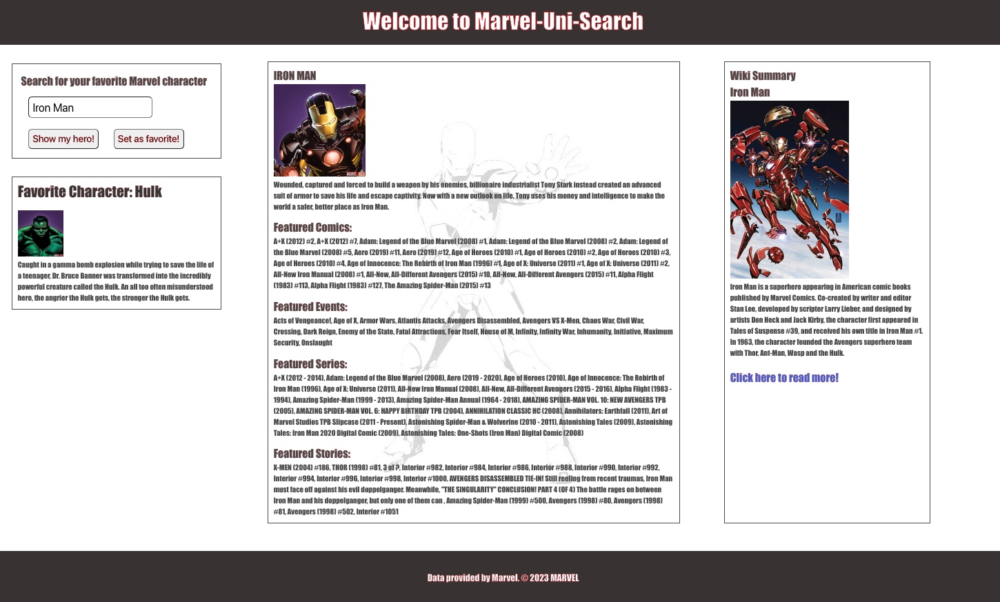

# Marvel-Uni-Search

## Description

Marval Uni Search is an application that will take the user's super hero search and display all of their information. Marvel fans can find out anything and everything about any marvel character in existence. The application simply displays Wikipedia and Marvel APIs.

## Installation

There is no installation required, all the user must do is go to the deployed application link below.

## Usage

Marvel Uni Search will display all of the comics, events, series, and stories that that marvel character is in. On the right side of the application, Wikipedia displays more information about that hero. The user may also save any hero as their favorite, which will display their information on the favorites section while continuing to search for other heros.

## Credits

List of Collaborators

Noah Simcoe - https://github.com/noahsimcoe

Zach Barnes - https://github.com/TooSparky

Andrew Perkins - https://github.com/adrummer1

Dale Talley III - https://github.com/daletalley

List of Third-Party Assets

Wikipedia - https://www.mediawiki.org/wiki/API:Main_page

Marvel - https://developer.marvel.com

## License

No current Licenses

## Screenshot

## Deployed Link

[Here is a link to the deployed application](https://noahsimcoe.github.io/Marvel-Uni-Search/)

